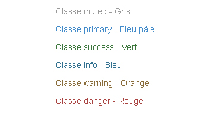
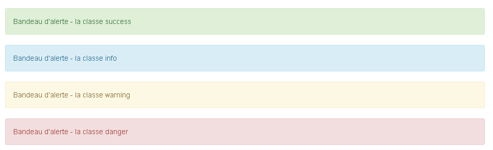

http://www.opentuto.com/installation-de-bootstrap-3/  
http://www.opentuto.com/premiere-page-html-avec-bootstrap-3/  
http://www.opentuto.com/comprendre-le-concept-de-grille-dans-le-webdesign/  
http://www.opentuto.com/creer-page-web-multigrille-bootstrap-3/  
http://www.opentuto.com/decaler-les-elements-dune-grille/ 
http://www.opentuto.com/imbriquer-plusieurs-grilles-dans-bootstrap-3/   
http://www.opentuto.com/imbriquer-plusieurs-grilles-dans-bootstrap-3/  
http://www.opentuto.com/laffichage-multiligne-dans-bootstrap-3/  
http://www.opentuto.com/afficher-cacher-du-contenu-bootstrap-3-en-fonction-du-support/  
http://www.opentuto.com/typographie-titres-et-paragraphes/  
http://www.opentuto.com/les-messages-dinformation-dans-bootstrap-3/  
http://www.opentuto.com/les-icones-bootstrap-3/  
Bootstrap fichiers à disposition sur le cloud.  
.min.css ficher optimisé avec espace retirés  
on ne modifie pas bootstrap  
créer feuille de style pour ne pas perdre ses modif à la maj    
fichier jquery au dessous boot  
fichier js en dessous  
js perso en dessous  
idem pour css qui se réalise aussi dans l'ordre  
plugin avec sublime txt autocomplémentation de bootstrap  

12 colonnes   
une ligne div de classe .row  
gutter x 11 espace plus ou moins grand défini automatiquement par bootstrap  
23 espaces  
	
 la div prendra 8 colonnes sans toucher au css  
  
disposition  
======
	
  
	

  
	

  
	
  
où x+y=12 pour rester sur même ligne, sinon passe automatiquement à la ligne 

changer nb col func taille screen
=======
	
 ... 
  
md: medium  
sm: small  
xs: extra small  
lg: large

espacer de x col
=======

génère un espace de deux colonnes    

quand on spécifie une talle en col ou % on part toujours de 12 ou 100% = parent  

on le touche pas au postionnement sur la feuille de style perso  

changer ordre
====
.col-md-push-* et .col-md-pull-*

affichage multiligne
=====
dans div row quand >12 col à la ligne auto

masquer afficher
====
visible.x
hidden.x

où x est :
md: medium  
sm: small  
xs: extra small  
lg: large

bordure
===
	
 
align txt
===

	

	

citation
======
	<blockquote> 
	"Identify your problems but give your power and energy to solutions." 
	<small>Tony Robbins</small> 
	</blockquote>

 

contenu dans titi cadre
====
	
Nullam ultricies ligula vehicula, laoreet urna pharetra, aliquam dui. Vestibulum sit amet venenatis mauris.

text gras 
===
	

messages info
=====
	
   Classe muted - Gris
 
	
 Classe primary - Bleu pâle
 
	
 Classe success - Vert
 
	
    Classe info - Bleu
 
	
 Classe warning - Orange
 
	
  Classe danger - Rouge

 
	
Bandeau d’alerte - la classe success
 
	
Bandeau d’alerte - la classe info
 
	
Bandeau d’alerte - la classe warning
 
	
Bandeau d’alerte - la classe danger

rq: js dans head et body essayer de comprendre pk

Badges
====
	
	<a href="#">Messages non lus2</a>

modifier .badge ds css boot to edit badge's style

icones
====
	<h1> Les  ic&ocirc;nes </h1> 
 
	<h1> Contact </h1> 
 
	
 Accueil
     
 
	 3 commentaires       
 
	<button class="btn btn-warning"> Ajouter au panier</button>      
 
	
 Classe warning

 
 Réseaux sociaux:
 ==============================================
     <i class="fa fa-linkedin-square"></i> 
    <i class="fa fa-facebook-square"></i> 
    <i class="fa fa-google-plus-square"></i> 

   qui se link  

	<link href="css/bootstrap.css" rel="stylesheet"> 
	<!-- Chargement de la feuille de style Font Awesome (font-awesome.min.css).-->
	<link href="css/font-awesome.min.css" rel="stylesheet">